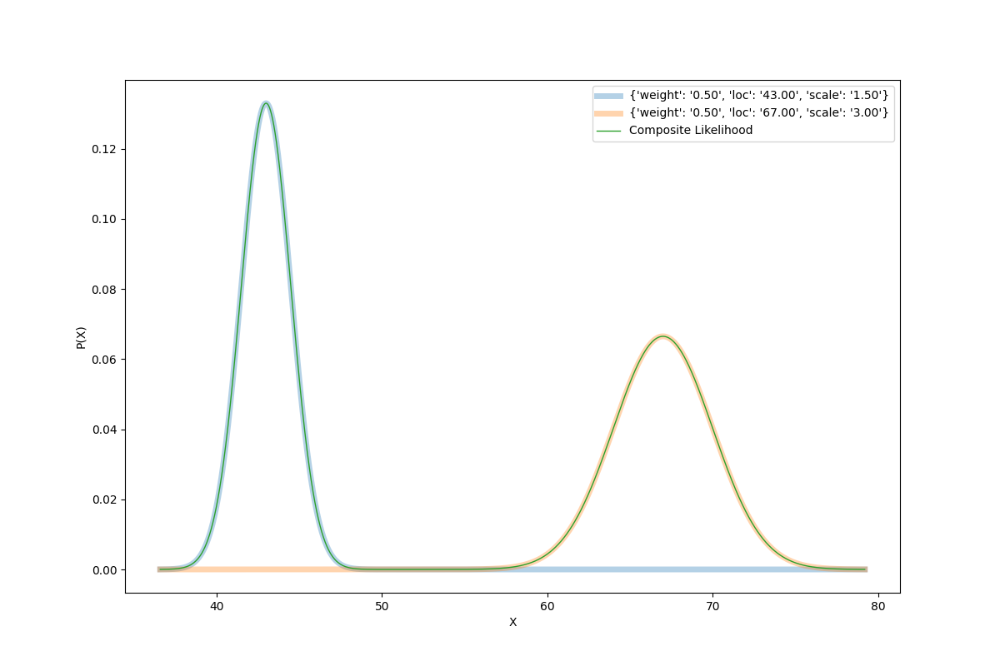
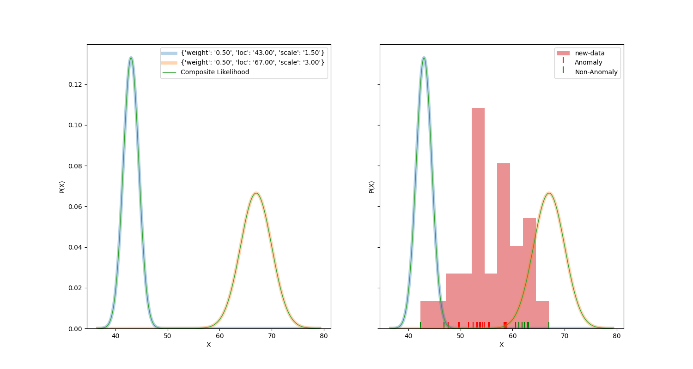

# anomix 

## What is it?

__anomix__ is a python package for estimating, and simulating uni-variate mixture models.
We primarily use [Expectation Maximization (EM)](https://en.wikipedia.org/wiki/Expectation%E2%80%93maximization_algorithm) for
parameter estimation. __anomix__ is specifically adapted to anomaly detection as well, 
estimating probabilities of observing given data, relying on the component distributions. 

__anomix__ was  primarily built with anomaly detection in mind, to uncover samples in data that 
appear to be unlikely given the data modeled as mixtures of a given univariate distributions. 

The models have built in plotting mechanisms once trained ot the data that can be extended 
to support more specific figure requirements. 

## Why? 

### EM

Expectation Maximization has some nice properties, with a guarantee to converge on the maximum likelihood estimate of 
the parameters. Also, for completeness in the python ecosystem, there are a several bayesian mixture modeling packages but
none seem to rely on EM. There also seems to be a similar package in [mixem](https://mixem.readthedocs.io/en/latest/), 
which implements much of the same EM fitting arcitecture. 
 

### Why anomalies?

Unsupervised anomaly detection is an increasingly important domain within the larger ML and statistical learning
literature (citation). There is a statistical literature that we can explore to construct well founded
probability estimates of the tails and the anomalies.  This work extends previous work in open source python packages 
for EM models into the domain of anomaly detection. 

### Example

A simple example would be to imagine the sampled heights of 18 year-olds, and of 5 year-olds. The heights can be expected
to be well represented as a mixture of two normals, with location parameters of 43 and 67 (inches),
and standard deviations of 1.5 and 3. 


```python
from anomix.models.models import NormalMixtureModel
height_model = NormalMixtureModel()
height_model.preset(weights=[.5,.5],loc=[43,67],scale=[1.5,3])
```

 OR by estimation

```python
from anomix.models.models import NormalMixtureModel
from numpy.random import normal
height_model = NormalMixtureModel()
data = normal(loc=[43, 67],scale=[1.5, 3], size=500).flatten()
height_model.fit(data)
f, ax = height_model.plot_pdf()
```



Then, we observe a new batch of individuals - a 5th grade classroom, with an average of 55 and a standard deviation of 3. 
We can test to see which of these new heights are anomalous given our model.

```python
new_data = normal(loc=55, scale=3, size=30)
anomalous = height_model.predict_anomaly(new_data, threshold=.95)
```

And we can overlay this on our pdf:

```python
f,axes = plt.subplots(1,2, sharey=True, figsize=(15,8))
f, ax1 = height_model.plot_pdf(show=False, fig_ax=(f, axes[0]))
f, ax2 = height_model.plot_pdf(show=False, fig_ax=(f, axes[1]))
_,_,s0 = ax2.hist(new_data, density=True,alpha=.5)
s1 = ax2.scatter(x=new_data[anomalous], y=np.zeros_like(new_data[anomalous]), c='red', marker=2,s=100, label='Anomalous')
s2 = ax2.scatter(x=new_data[~anomalous], y=np.zeros_like(new_data[~anomalous]), c='green', marker=2,s=100, label='Non-Anomalous')
ax2.legend([s0, s1,s2],['new-data','Anomaly','Non-Anomaly'])
plt.show()
```



## Distributions Supported

- Normal
- LogNormal
- Exponential
- Cauchy(*)
- Students T (*)
- Binomial
- Poisson
- Geometric
- ZeroInflatedNormal
- Zeta/Zipf(*)

(*) means non-EM based parameter estimation

## Installation

### Compile from source

`git clone <this url>`

`pip install . -e anomix` 


### Download from pypi and install using `pip`

`pip install anomix`

TODO: Register on pypi


## Contributing

- We want to continue to add new models. Just replicate the model structures within 'univariate',  implement all abstract classes.
- We are considering mixtures with implementing multivariate data. See the branch 'multivariate' for the work that was started there
 

### Future improvements
- standardize the _fit_ method a lil bit more
- more anomaly prediction options 
- tox
- more full tests?
- more docs
- travis yaml? (not sure who this is but i see it on many projects its useful haha)
- maybe add \[smm] option to pip install, in case ppl dont want Students T MM
    - pip install anomix\[em] maybe installs only the EM ones?  (aka non-cauchy, zeta, smm)


### other potential methods of verifying the estimates:

- variance of parameter estimate is approx normal with variance ~ 1/n
    - could run a bunch of data simulations and estimations to observe the variance of the estimator is normal around the
      true estimate
      